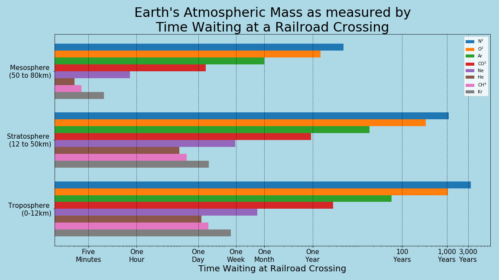
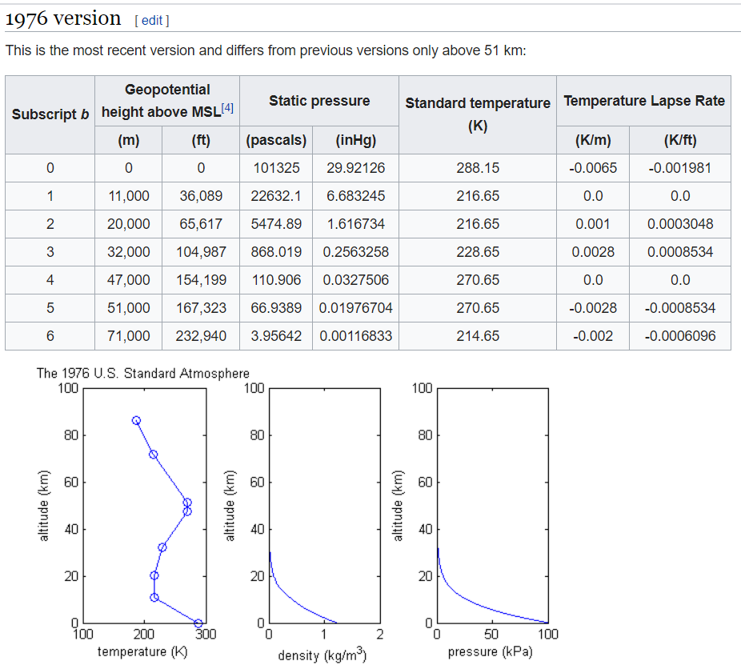

# 1976 U.S. Standard Atmosphere Model
# r/dataisbeautiful's DataViz Battle for December 2019

## About the Chart
Have you ever wondered just how massive our atmosphere is? This bar chart shows how long you would sit at a railroad crossing if the mass of each compound and element was transformed into a large freight hopper of equal mass.

## Background
December 2019 Reddit's r/dataisbeautiful's DataViz Battle deals with the 1976 version of the U.S. Standard Atmosphere Model. While the dataset itself is small (about 50 datapoints total, and some say the same things but in different units.) what it describes is incredibly complex. More background research is required here to understand what claims are reasonable. 

With some of the more reasonable compasions visualized right below the dataset provided, it seems silly just to re-create one of those. Therefore a second dataset or model should be included for this project. 

## Gameplan
The ideal gas law (PV = *n*RT) states that if one knows three out of four values, one can determine the fourth value.  
Variable | Definition| Ready?
---------|-----------|-------------
V|The radius of the Earth is a known value, with this information one can determine volume.|Yes
T| Temperature is a listed value on the U.S. Standard Atmosphere 1976 table.| Yes
P| ~~The Barometric Formula will provide pressure. (This also uses information from the U.S. Standard Atmosphere 1976 table)~~  Pressure obtained from the Altitude Table dataset.|Yes
R| R is a constant value called the gas constant. 8.31446261815324|Yes

Entering the required values into the table provides the mols of atmosphere in each subscript. Knowing the atmospheric composition breakdown allows one to determine the mass of each element and compound in each subscipt, and those values will be entered into a table for visualization.

## Comparison Problem
Unfortunately an unforseen problem arrose with the values. There is 7.33E+15 kg of N2 in the first 2,000 meters of our atmosphere. This number is incomprehensible for most people. There is also such a range in values that something comparable to 7.33E+15 kg would be useless for a value of 2.07E+05 kg of Kr.

After much thinking and many discussions, time was chosen as the measurement. The mass of each element and compound was converted from kg into large hopper rail cars (each massing 130,000kg) and multiplied by the length of the car to get a total length for the train. Each train was assumed to travel at just under 129 kph to get the time it would take for the train to pass a railroad crossing.

While not perfect, wait times of less than five minutes to over 3,000 years seems more relatable than 2.07E+05 kg and 7.33E+15 kg.

## Visualization
Going with some simple bar charts here to show comparisions between each element and compound by layer of atmosphere. Changed the background to a light blue because the sky we see is blue. Also wanted to mess with the bars. Thought about changing their color to show the element/compound they represent, but finding a common metric that didn't use repeat colors (all noble gases as pink in CPK for example) proved too difficult. Also thought about using actual freight train cars in the bar graph, but that also proved too difficult with the little time remaining before the project is due. It is something to explore in the future.

## Links
[r/dataisbeautiful Dataviz Battle for December 2019](https://www.reddit.com/r/dataisbeautiful/comments/e7squa/battle_dataviz_battle_for_the_month_of_december/)  
[U.S. Standard Atmosphere 1976 Version](https://en.wikipedia.org/wiki/U.S._Standard_Atmosphere#1976_version)  
[CSV for periodic table of elements](https://gist.github.com/GoodmanSciences/c2dd862cd38f21b0ad36b8f96b4bf1ee)  
[Barometric Formula](https://en.wikipedia.org/wiki/Barometric_formula)  
[Altitude Table](http://www.pdas.com/atmosTable1SI.html)
